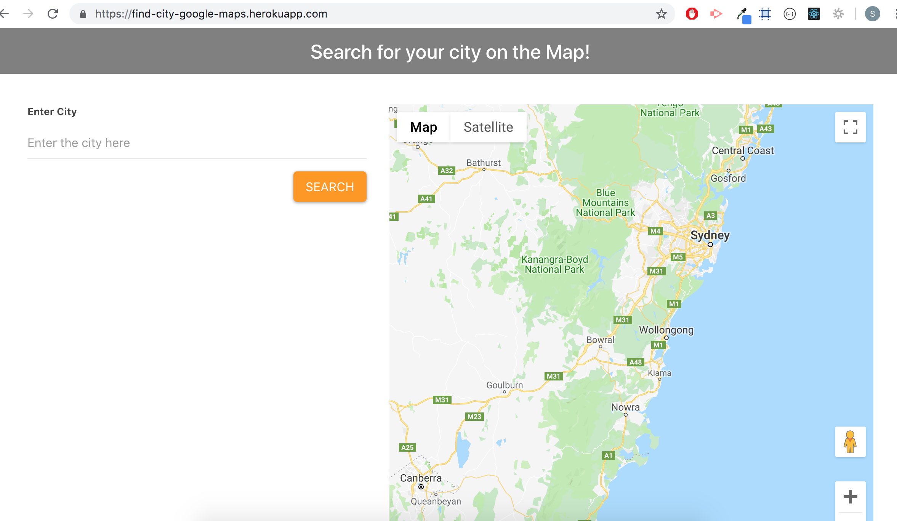
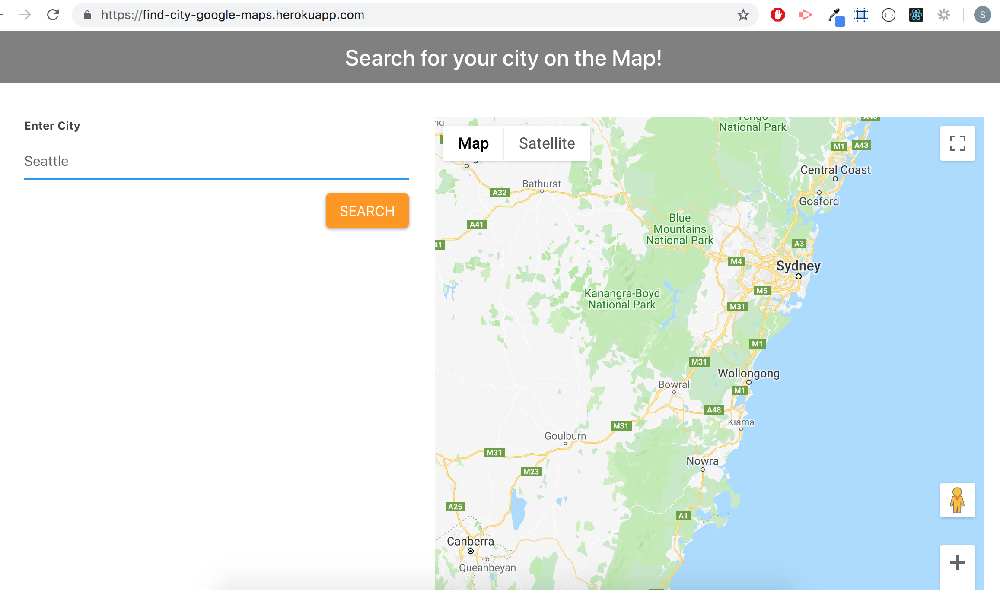
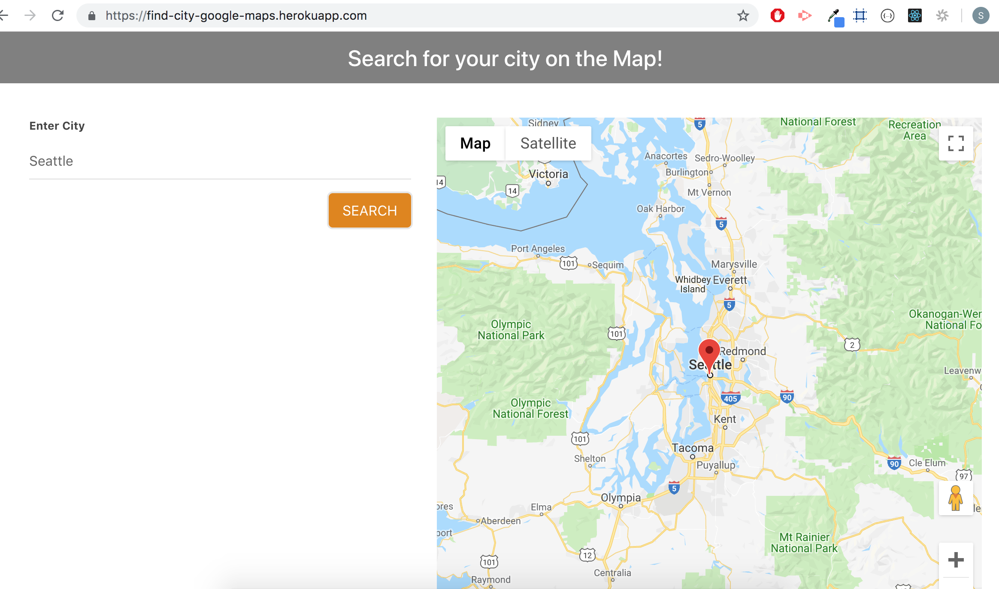

# :earth_asia: find-the-city-google-maps

### Overview
---
A simple web application that displays the location of a city on a Map based on the user input. This is built on React components, and utilizes React lifecycle methods to query and display city based on user searches. This app uses React, Node, Express and the Google Place Library.

### Getting Started
---
* Clone the repo ``` git@github.com:liaswapna/find-the-city-google-maps.git```.
* Navigate to the repo ```cd find-the-city-google-maps```.
* Run command ```npm install``` in Terminal or GitBash
* Run command ```npm start``` to start ther server.

### Technologies Used
---
* React
* Bootstrap 
* Express
* NodeJS
* Google Place

### Dependencies
---
Client side
```js
{
"react": "^16.8.4",
"react-dom": "^16.8.4",
"react-materialize": "^2.6.0",
"react-scripts": "^2.1.8"
}
```
Server side
```js
{
"axios": "^0.18.0",
"express": "^4.16.3",
"if-env": "^1.0.4",
}
```

### Demos
---
* Search City
* [Heroku Link](https://find-city-google-maps.herokuapp.com/)

### Screenshots
---
#### Deployed App View

* Search city Page

     

* Enter a city name

    * 

* Display city on map

    * 

